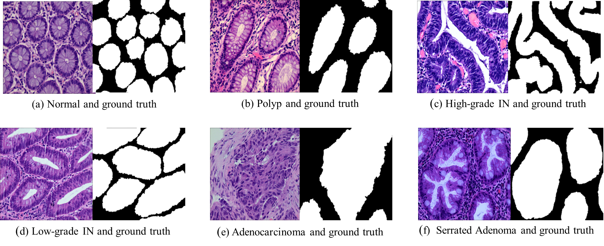
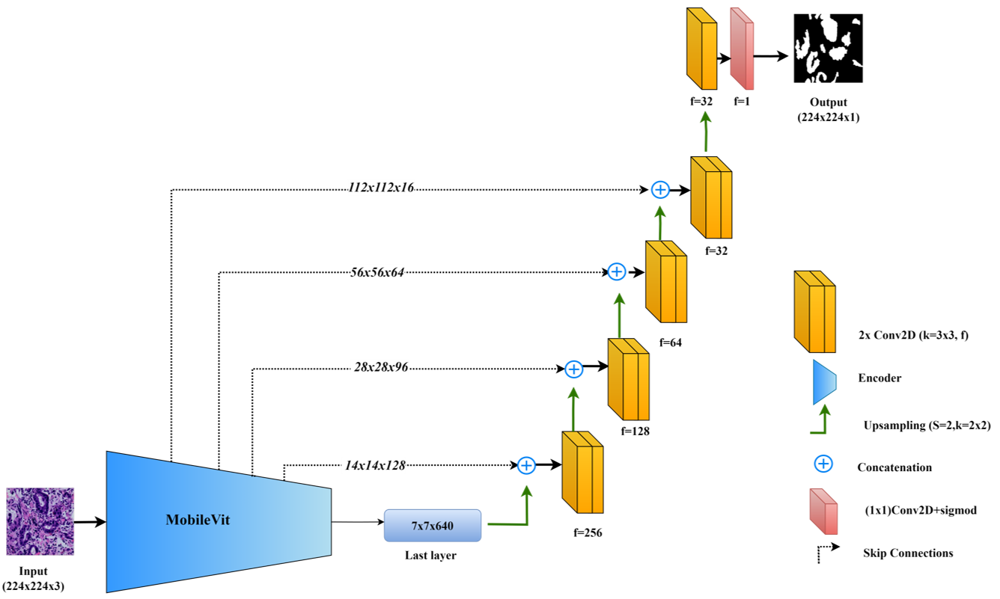

# Optimizing Colorectal Cancer Segmentation with MobileViT-UNet and Multi-Criteria Decision Analysis


Colorectal cancer represents a significant health challenge as one of the deadliest forms of malignancy. Manual examination methods suffer from limitations such as subjectivity and data overload, necessitating the development of computer-aided diagnostic systems. This study investigates the segmentation of colorectal cancer regions into normal tissue, polyps, high-grade intraepithelial neoplasia, low-grade intraepithelial neoplasia, adenocarcinoma, and serrated adenoma, using proposed segmentation models:\textbf{ VGG16-UNet, ResNet50-UNet, MobileNetV1-UNet, and MobileViT-UNet.} This is the first study to integrate MobileViT as a UNet encoder. Each model was trained with two distinct loss functions, binary cross-entropy and dice loss, and evaluated using metrics including Dice Ratio, Jaccard Index, Precision, and Recall. The MobileViT-UNet+Dice loss emerged as the leading model in colorectal histopathology segmentation, consistently achieving high scores across all evaluation metrics. Specifically, it achieved a Dice Ratio in the range of \textbf{0.9243-0.9694}, a Jaccard Index in the range of \textbf{0.8598-0.9406}, Precision in the range of \textbf{0.9490-0.9860}, and Recall in the range of \textbf{0.9011-0.9492} across all classes. To further obtain the best performing model, we employed Multi-Criteria Decision Analysis (MCDA) using the Technique for Order of Preference by Similarity to Ideal Solution (TOPSIS). This analysis revealed that the MobileViT-UNet+Dice model achieved the highest TOPSIS scores of \textbf{0.9628} (avg) across all classes, thereby attaining the highest ranking among all models. Our comparative analysis includes benchmarking with existing works, the results highlight that our best-performing model (MobileViT-UNet+Dice) significantly outperforms existing models, showcasing its potential to enhance the accuracy and efficiency of colorectal cancer segmentation.

This repository provides the implementation of MobileViT-UNet+DICE
## Dataset
The Dataset used for study is EBHI-Seg and is publicly available at: https://doi.org/10.6084/m9.figshare.21540159.v1. \
The detailed infromation of the dataset can be found in following paper: https://doi.org/10.3389/fmed.2023.1114673

For this study we have performed augmentation to certain classes to handle class imbalance issuse.The augmentation techniques
utilized in this study include horizontal flip,vertical flip, transpose and random rotation 90 degree. 

The Augmented dataset used in this study can be downloaded from here:-https://drive.google.com/drive/folders/1fLg5A99-bVwSvjKfPgBacaZh6RinkAWq?usp=sharing 

The splits of the dataset (Train,Val,Test) used in this study is provided in `\Splits` directory. The files are 
```
---/training_images.csv---->contains the images names and class name in form of path of images used in training
---/training_mask.csv---->contains the segmentation mask names and class name in form of path of corresponding masks used in training
---/val_images.csv---->contains the images names and class name in form of path of images used in validation during training
---/val_mask.csv---->contains the segmentation mask names and class name in form of path of corresponding masks used in validation during training
---/test_images.csv---->contains the images names and class name in form of path of images used in evaluation
---/test_mask.csv---->contains the segmentation mask names and class name in form of path of corresponding masks used in evaluation
```

      
 


## Implementation 

The Implementation of the study is provided in the `/src` directory. The ```Mobilevit_dice.ipynb``` notebook is divided into following sections:

### Data loading pipeline

The section provides the code for a custom data generator reponsible for loading and creating instance of training generator and validation generator.

#### Preview of code

```python
class data_generator(tf.keras.utils.Sequence):
    def __init__(self, image_paths,mask_path, batch_size=32,shuffle=False, backbone='resnet18',image_size=(224,224),p_status=False):
        self.image_paths=image_paths
        self.mask_paths=mask_path
        self.batch_size = batch_size
        self.shuffle = shuffle
        self.backbone=backbone
        self.preprocessing= sm.get_preprocessing(self.backbone)
        self.image_size=image_size
        self.p_status=p_status
        self.on_epoch_end()
    def __len__(self):
        return int(np.ceil(len(self.image_paths) / self.batch_size))
    def __getitem__(self,idx):
        start_idx = idx * self.batch_size
        end_idx = (idx + 1) * self.batch_size
        img_batch=self.image_paths[start_idx:end_idx]
        mask_batch=self.mask_paths[start_idx:end_idx]
        X=[]
        Y=[]
        

        for i,value, in enumerate(img_batch):
             bgr_image=cv2.imread(img_batch[i])
             rgb_image=cv2.cvtColor(bgr_image, cv2.COLOR_BGR2RGB)
             rgb_image=cv2.resize(rgb_image,self.image_size)
             mask=cv2.imread(mask_batch[i])
             mask=cv2.resize(mask,self.image_size)
             mask=cv2.cvtColor(mask, cv2.COLOR_BGR2GRAY)
             #print(value)
             if self.p_status==True:
                 rgb_image=self.preprocessing(rgb_image)
             X.append(rgb_image/255)
             Y.append(mask/255.0)
        
        return np.array(X),np.expand_dims(np.array(Y),axis=3)
    def on_epoch_end(self):#dont use this 
        if self.shuffle==True:
            np.random.shuffle(self.image_paths)
            np.random.shuffle(self.mask_paths)
            

    def __iter__(self):
        # Initialize the iteration index
        self.current_idx = 0
        return self

    def __next__(self):
        if self.current_idx >= len(self):
            raise StopIteration
        else:
            batch = self.__getitem__(self.current_idx)
            self.current_idx += 1
            return batch
                

train_images_paths=np.load("../EBHI-SEG/EBHI-SEG/train_images.npy",allow_pickle=False)#Replace with your own dataset directory or numpy file
train_mask_paths=np.load("../EBHI-SEG/EBHI-SEG/train_mask.npy",allow_pickle=False)#Replace with your own dataset directory or numpy file
val_images_paths=np.load("../EBHI-SEG/EBHI-SEG/val_image.npy",allow_pickle=False)#Replace with your own dataset directory or numpy file
val_mask_paths=np.load("../EBHI-SEG/val_mask.npy",allow_pickle=False)#Replace with your own dataset directory or numpy file
```

### Implementation of  MobileViT-Unet architecture 
This section of the notebook provide the implementation of MobileViT-Unet architecture.

#### Preview of code

```python
def Mb_UNet(input_shape, num_classes):
   
    #ENCODER
    #-------------------------------------------------------------------------------
    # Will download and load pretrained imagenet weights.
    mm = mobilevit.MobileViT_S(input_shape=(224,224,3),pretrained="imagenet")
    # last feature layer of mobilevit
    x=mm.get_layer('features_swish').output 
    #skip connections
    skip_connections_names=['stem_conv','stack2_block1_deep_3_conv','stack3_block1_deep_3_conv','stack4_block1_deep_3_conv']
    Skip_connection_layers=[mm.get_layer(name).output for name in skip_connections_names]
    mm.trainable=True ............................

```

### Training Configuration and Training model
This sections of the notebook provide the code of initializing the training parameters and training of the model.
The implementation can be used when you need to train the model on the dataset on own set of hyperparameter.
#### Preview of code

```python
# Parameter for training 
BATCH_SIZE = 8
number_of_class=1
LR = 0.0001
EPOCHS = 40

Backbone='mobile_vit_only_unet_dice'

Loss=sm.losses.dice_loss
optm=tf.keras.optimizers.Adam(LR)

#calling of model
model = Mb_UNet((224,224,3),number_of_class)
metrics = [sm.metrics.IOUScore(threshold=0.5), sm.metrics.FScore(threshold=0.5)]

model.compile(optm,Loss, metrics)
callbacks = [
    tf.keras.callbacks.ModelCheckpoint('./'+Backbone+".h5", save_best_only=True, mode='min'),
    tf.keras.callbacks.EarlyStopping(monitor='val_loss',patience=5)
]
```
### Evaluation of Our Model in test_set
In this section we have evaluated our trained proposed model on the test set of the dataset. 
The weights of the proposed model can be downloaded from here:-https://drive.google.com/file/d/1BdQWXTszDGFZamRky7WYCyXUebRH70GM/view?usp=sharing
This weights is used to produce the result mentioned in the paper.
* Note: During evalutaion please dont run the cell of "Training model" of the notebook
#### Preview of code
``` python 
from sklearn.metrics import precision_score, recall_score

def evaluate_pred(img_path,mask_path,key):
    precision=[]
    recall=[]
    for i,value in enumerate(img_path):
        bgr_image=cv2.imread(img_path[i])
        rgb_image=cv2.cvtColor(bgr_image, cv2.COLOR_BGR2RGB)
        rgb_image=cv2.resize(rgb_image,(224,224))
        mask=cv2.imread(mask_path[i])
        mask=cv2.resize(mask,(224,224))
        mask=cv2.cvtColor(mask, cv2.COLOR_BGR2GRAY)
       
        mask=mask.astype(bool).astype(int)
        image=np.expand_dims(rgb_image/255,axis=0)
        
        prd_mask=model.predict(image,verbose=False)
        pr_mask=prd_mask.squeeze()
        threshold = 0.5
        pr_mask= pr_mask > threshold
        
        pr_mask=pr_mask.astype(np.uint8)
        precision.append(precision_score(mask.flatten(), pr_mask.flatten(),))
        recall.append(recall_score(mask.flatten(), pr_mask.flatten()))
    precision=np.mean(np.array(precision))
    recall=np.mean(np.array(recall))
    return precision,recall


key=["Adenocarcinoma","High-grade IN","Low-grade IN","Normal","Polyp","Serrated adenoma"]
model.load_weights('D:/side_project/kid_project/mobile_vit_only_unet_dice.h5') #loading model weights
mean_iou=[]
mean_dice=[]
mean_p=[]
mean_r=[]
for i in key:

    test_images_paths=np.load("D:/side_project/kid_project/EBHI-SEG/EBHI-SEG/Adenocarcinoma/train/"+i+"_test_images.npy",allow_pickle=False)
    test_mask_paths=np.load("D:/side_project/kid_project/EBHI-SEG/EBHI-SEG/Adenocarcinoma/train/"+i+"_test_mask.npy",allow_pickle=False)
    test=data_generator(test_images_paths,test_mask_paths,8)
    scores = model.evaluate_generator(test)
    print("Loss: {:.5}".format(scores[0]))
    for metric, value in zip(metrics, scores[1:]):
        if metric.__name__=='iou_score':
            mean_iou.append(value)
        else:
            mean_dice.append(value)
        print("mean {} of {}: {:.5}".format(metric.__name__,i, value))

    p,r=evaluate_pred(test_images_paths,test_mask_paths,i)
    mean_p.append(p)
    mean_r.append(r)
b='MobileVit-Unet+Dice'        
dict={"Model":b,"type_of_images":key,"Iou":mean_iou,'Dice':mean_dice,'Precision':mean_p,'Recall':mean_r}

```


## Prerequisites

Following packages will require to run this notebook

```
--Python 3.10
 ----tensoflow-gpu 2.10.1
 ---keras 2.10
 ---numpy
 ---opencv
 ---pandas
 ---matplotlib
 ---scikit-learn
 ---segmentation models 
    link->https://github.com/qubvel/segmentation_models
    usage: for loss functions
 ---keras_cv_attention_models
    link->https://github.com/leondgarse/keras_cv_attention_models
    usage->base model architecture and pretrained weights
```

## Authors

- Barun Barua
- Genevieve Chyrmang
- Kangkana Bora
- Manob jyoti Saikia


## Acknowledgements

The authors thank the Biomedical Sensors \& Systems Lab, University of North Florida Jacksonville, FL 32224, USA for supporting this research and article processing charges.

